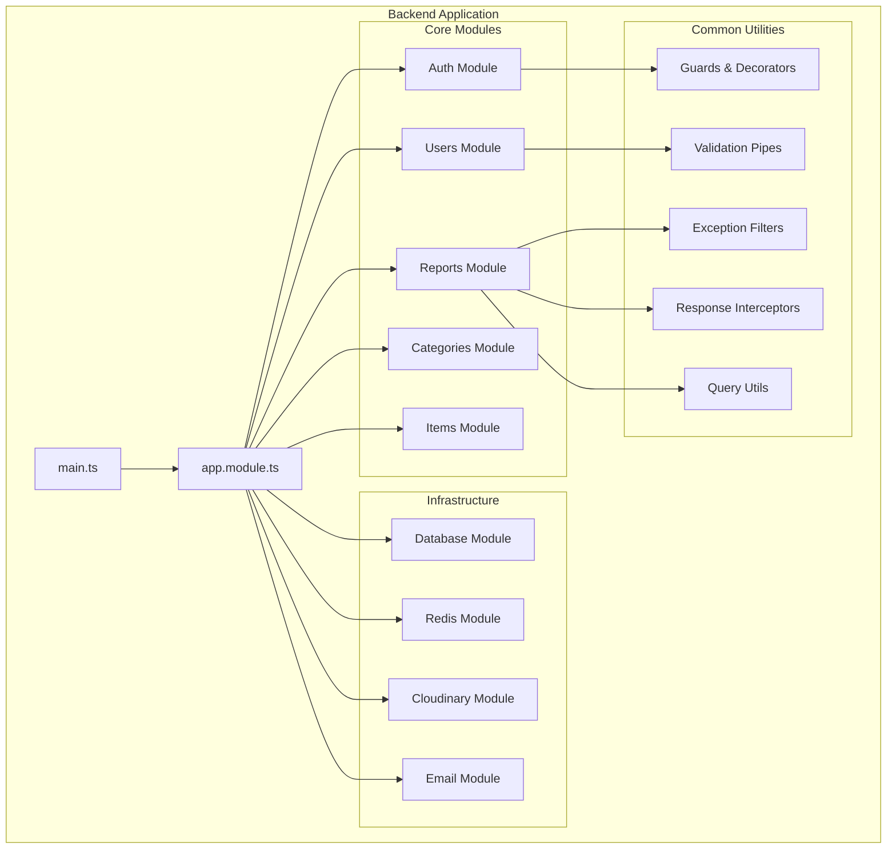

# Mafqood API (NestJS)

A production-ready NestJS (v11) REST API for the Mafqood platform. It powers lost-and-found reports with pagination, search, sorting, authentication, image uploads (Cloudinary), email, and robust error handling.

## Features

- Authentication and authorization (JWT)
- Reports module with server-side pagination, search, and sorting
- Categories, Items, Users modules
- Image uploads via Cloudinary (memory storage + provider)
- Centralized validation (class-validator) and transformation (class-transformer)
- Global exception filters and response interceptor
- MongoDB (Mongoose) with providers-based architecture
- CORS enabled and configurable
- Structured, modular NestJS codebase
- **Redis caching** for improved performance

## Performance Benchmarks

### Redis Caching Impact

The implementation of Redis caching has significantly improved the API's performance:

#### Before Redis Caching
- **Throughput**: 10.41 requests/second
- **Average Response Time**: 1,109 ms
- **Total Requests Handled**: 3,326


#### After Redis Caching
- **Throughput**: 16.56 requests/second (**+59% improvement**)
- **Average Response Time**: 375 ms (**-66% improvement**)
- **Total Requests Handled**: 5,075 (**+53% more requests**)


> [!IMPORTANT]
> Redis caching reduced response times by **66%** and increased throughput by **59%**, enabling the API to handle significantly more concurrent users with better performance.

## Tech Stack

- NestJS 11, TypeScript
- MongoDB + Mongoose 8
- **Redis** (caching layer)
- JWT, Passport
- class-validator, class-transformer
- Cloudinary, Multer memory storage
- Nodemailer (email)
- Morgan (logging)

## Prerequisites

- Node.js ≥ 18
- MongoDB instance
- **Redis server** (for caching)
- Cloudinary account (for image hosting)
- SMTP creds (optional: for email)

## Getting Started

1. Install dependencies

```bash
npm ci
```

2. Create a `.env` file in `backend/`

```bash
# Server
PORT=3000
NODE_ENV=development
FRONTEND_ORIGIN=http://localhost:5173

# Database
MONGODB_URI=mongodb://localhost:27017/mafqood

# Redis
REDIS_HOST=localhost
REDIS_PORT=6379

# JWT
JWT_SECRET=replace_me
JWT_EXPIRES_IN=7d

# Cloudinary
CLOUDINARY_CLOUD_NAME=your_cloud
CLOUDINARY_API_KEY=your_key
CLOUDINARY_API_SECRET=your_secret

# Email (optional)
SMTP_HOST=smtp.example.com
SMTP_PORT=587
SMTP_USER=username
SMTP_PASS=password
```

3. Run the server

```bash
# development
npm run start:dev

# production
npm run build && npm run start:prod
```

The API starts on `http://localhost:${PORT}` with a global prefix `api/v1`.

> Note: In `src/main.ts` CORS is enabled. Adjust `origin` (default was `http://localhost:8080`) to your frontend origin (e.g., `http://localhost:5173`).

## API

### Reports – List with pagination/search/sort

GET `/api/v1/reports`

Query parameters:

- `page` (number, default 1)
- `limit` (number, default 12 or backend default)
- `search` (string, optional) — searches across `title`
- `sortBy` (string, e.g. `createdAt`)
- `sortOrder` (`ASC` | `DESC`, default `DESC`)

Response (shape based on service):

```json
{
  "message": "Get All Reports Successfully",
  "total": 123,
  "page": 1,
  "totalPages": 11,
  "reports": []
}
```

### Auth, Users, Items, Categories

Modules exist for these features. Endpoints typically live under `/api/v1/<module>` and follow NestJS best practices. Check the corresponding `src/<module>` directories.

## Project Structure

### Architecture Overview



### Detailed File Structure

```
backend/
├── src/
│   ├── main.ts                          # Application entry point
│   ├── app.module.ts                    # Root module
│   │
│   ├── auth/                            # Authentication & Authorization
│   │   ├── auth.module.ts
│   │   ├── Controller/
│   │   │   └── auth.controller.ts       # Login, signup, OAuth endpoints
│   │   ├── dtos/
│   │   │   ├── logIn.dto.ts
│   │   │   └── signUp-user.dto.ts
│   │   ├── guards/
│   │   │   ├── auth.guard.ts            # JWT authentication guard
│   │   │   └── google-auth.guard.ts     # Google OAuth guard
│   │   ├── service/
│   │   │   └── auth.service.ts
│   │   └── strategies/
│   │       ├── google.strategy.ts       # Passport Google strategy
│   │       └── jwt.strategy.ts          # Passport JWT strategy
│   │
│   ├── users/                           # User Management
│   │   ├── users.module.ts
│   │   ├── users.providers.ts
│   │   ├── Controller/
│   │   │   ├── Admin/
│   │   │   │   └── users.controller.ts  # Admin user management
│   │   │   └── userMe/
│   │   │       └── user-me.controller.ts # Current user profile
│   │   ├── dto/
│   │   │   └── Admin/
│   │   │       ├── create-user.dto.ts
│   │   │       └── update-user.dto.ts
│   │   ├── interfaces/
│   │   │   └── user.interface.ts
│   │   ├── schema/
│   │   │   └── user.schema.ts           # Mongoose user schema
│   │   └── service/
│   │       ├── Admin/
│   │       │   └── users.service.ts
│   │       └── userMe/
│   │           └── user-me.service.ts
│   │
│   ├── reports/                         # Lost & Found Reports
│   │   ├── reports.module.ts
│   │   ├── reports.providers.ts
│   │   ├── controller/
│   │   │   ├── Admin/
│   │   │   │   └── reports.controller.ts # Admin report management
│   │   │   └── Users/
│   │   │       └── myReports.controller.ts # User's own reports
│   │   ├── dto/
│   │   │   ├── create-report.dto.ts
│   │   │   └── update-report.dto.ts
│   │   ├── interface/
│   │   │   └── reports.interface.ts
│   │   ├── schema/
│   │   │   └── report.schema.ts         # Mongoose report schema
│   │   └── service/
│   │       ├── Admin/
│   │       │   └── reports.service.ts   # With Redis caching
│   │       └── Users/
│   │           └── myReports.service.ts
│   │
│   ├── categories/                      # Report Categories
│   │   ├── categories.module.ts
│   │   ├── categories.controller.ts
│   │   ├── categories.provider.ts
│   │   ├── categories.service.ts
│   │   ├── dto/
│   │   │   ├── create-category.dto.ts
│   │   │   └── update-category.dto.ts
│   │   ├── interface/
│   │   │   └── categories.interface.ts
│   │   └── schema/
│   │       └── category.schema.ts
│   │
│   ├── items/                           # Lost/Found Items
│   │   ├── items.module.ts
│   │   ├── items.controller.ts
│   │   ├── items.providers.ts
│   │   ├── items.service.ts
│   │   ├── dto/
│   │   │   ├── create-item.dto.ts
│   │   │   └── update-item.dto.ts
│   │   ├── interface/
│   │   │   └── items.interface.ts
│   │   └── schema/
│   │       └── item.schema.ts
│   │
│   ├── cloudinary/                      # Image Upload Service
│   │   ├── cloudinary.module.ts
│   │   ├── cloudinary.provider.ts
│   │   ├── cloudinary.service.ts
│   │   └── cloudinary-response.ts
│   │
│   ├── redis/                           # Redis Caching
│   │   └── redis.module.ts              # Cache configuration
│   │
│   ├── email/                           # Email Service
│   │   ├── email.module.ts
│   │   └── email.service.ts             # Nodemailer integration
│   │
│   ├── DataBase/                        # Database Configuration
│   │   ├── database.module.ts
│   │   └── database.providers.ts        # MongoDB connection
│   │
│   └── common/                          # Shared Utilities
│       ├── decorators/
│       │   ├── mongo-id-param.decorator.ts # MongoDB ID validation
│       │   └── roles.decorator.ts       # Role-based access control
│       ├── dto/
│       │   └── query-options.dto.ts     # Pagination, search, sort
│       ├── filters/
│       │   ├── all-exceptions.filter.ts # Global exception handler
│       │   └── mongoose-validation.filter.ts
│       ├── guard/
│       │   └── roles.guard.ts           # Role authorization guard
│       ├── interceptors/
│       │   └── response.interceptor.ts  # Response formatting
│       ├── interface/
│       │   └── pagination-result.interface.ts
│       ├── pipes/
│       │   └── parse-mongo-id.pipe.ts   # MongoDB ID parsing
│       └── utils/
│           └── query.util.ts            # Query helpers (pagination, filtering)
│
├── dist/                                # Compiled output
├── node_modules/                        # Dependencies
├── .env                                 # Environment variables
├── .gitignore
├── .prettierrc
├── eslint.config.mjs
├── nest-cli.json
├── package.json
├── package-lock.json
├── tsconfig.json
└── tsconfig.build.json
```

### Notable Common Utilities

- `common/dto/query-options.dto.ts` — `page`, `limit`, `search`, `sortBy`, `sortOrder`
- `common/utils/query.util.ts` — `paginateAndFilter()` helper (Mongoose)
- `common/filters/*` — exception filters
- `common/interceptors/response.interceptor.ts` — response envelope/interception

## Scripts

```bash
npm run start         # start
npm run start:dev     # dev with watch
npm run build         # compile to dist
npm run lint          # eslint
npm run test          # unit tests (jest)
npm run test:e2e      # e2e tests
```

## Deployment

- Provide proper `.env` values
- Build: `npm run build`
- Run: `node dist/main.js`
- Ensure CORS `origin` matches your deployed frontend URL

## License

This project uses various OSS dependencies. Your application code is under your repository’s license.
